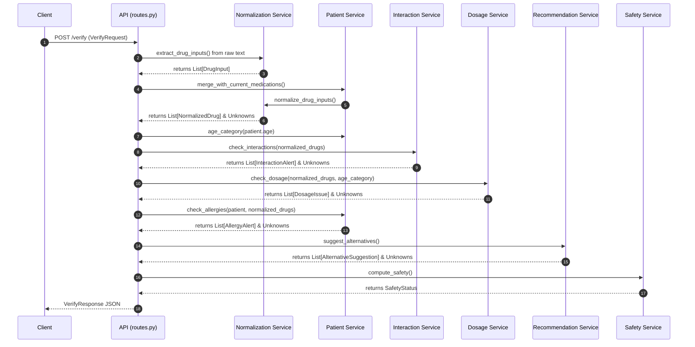
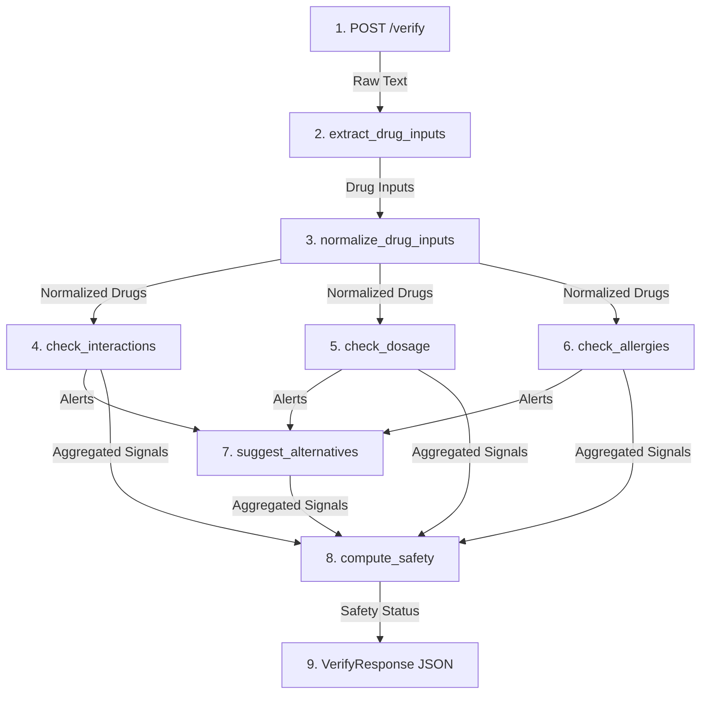

# SafeDose Backend Forensic Audit Report

This report outlines the current structural and functional behavior of the SafeDose backend codebase, detailing how inputs are parsed, processed, validated, and normalized. 

---

## SECTION 1 - PROJECT STRUCTURE

### 1. Active File Registry
* **[backend/main.py](file:///E:/Projects/gen%20ai/prescription-verifier/backend/main.py)**: The FastAPI entry point. Configures CORS middleware, registers routes, and handles the root endpoint request.
* **[backend/app/main.py](file:///E:/Projects/gen%20ai/prescription-verifier/backend/app/main.py)**: A shallow re-exporter that imports the `app` instance from `backend.main`.
* **[backend/app/models.py](file:///E:/Projects/gen%20ai/prescription-verifier/backend/app/models.py)**: Contains the legacy Pydantic models (e.g. `VerificationResponse`, `Drug`, `DosageAlert`). **Note: This file is currently dead code.**
* **[backend/app/ocr_processor.py](file:///E:/Projects/gen%20ai/prescription-verifier/backend/app/ocr_processor.py)**: Implements local OCR capability using OpenCV and `pytesseract` to process prescription image uploads.
* **[backend/api/routes.py](file:///E:/Projects/gen%20ai/prescription-verifier/backend/api/routes.py)**: Defines active FastAPI route handlers (`/verify` and `/extract-text`).
* **[backend/models/schemas.py](file:///E:/Projects/gen%20ai/prescription-verifier/backend/models/schemas.py)**: Declares the active Pydantic models used by the router for validation (e.g., `VerifyRequest`, `VerifyResponse`, `NormalizedDrug`).
* **[backend/services/data_loader.py](file:///E:/Projects/gen%20ai/prescription-verifier/backend/services/data_loader.py)**: Loads JSON datasets (`interactions.json`, `dosage_rules.json`, etc.) with `@lru_cache` to minimize file system reads.
* **[backend/services/normalization_service.py](file:///E:/Projects/gen%20ai/prescription-verifier/backend/services/normalization_service.py)**: Houses regex-based text parsing, tokenization, alias mappings, and fuzzy matching pipelines.
* **[backend/services/patient_service.py](file:///E:/Projects/gen%20ai/prescription-verifier/backend/services/patient_service.py)**: Normalizes incoming patient medication lists, determines patient age categories, and validates allergy mappings.
* **[backend/services/interaction_service.py](file:///E:/Projects/gen%20ai/prescription-verifier/backend/services/interaction_service.py)**: Identifies drug-drug interactions between pairs of normalized drugs.
* **[backend/services/dosage_service.py](file:///E:/Projects/gen%20ai/prescription-verifier/backend/services/dosage_service.py)**: Checks if the parsed mg/day dosage falls within range limits for a given age group.
* **[backend/services/recommendation_service.py](file:///E:/Projects/gen%20ai/prescription-verifier/backend/services/recommendation_service.py)**: Identifies alternatives for problematic drugs and performs safety checks on them.
* **[backend/services/safety_service.py](file:///E:/Projects/gen%20ai/prescription-verifier/backend/services/safety_service.py)**: Integrates alerts to produce an overall safety classification.

### 2. File Responsibilities
* **Routing & Entrypoints**: `main.py` and `routes.py` define the REST endpoint contracts.
* **Data Layer**: `data_loader.py` fetches configurations and rules from JSON files in the `backend/data/` directory.
* **Business Logic Services**: Individual files in `backend/services/` compute validation parameters independently.
* **OCR**: `ocr_processor.py` acts as a service layer for processing raw binary image data.

### 3. Entry Points
* **REST API Entrypoint**: `backend.app.main:app` (resolves to `backend.main:app` running on port 8000).
* **CLI/Process Command**: `run-project.ps1` starts uvicorn.

### 4. Complete Request Flow



---

## SECTION 2 - DRUG EXTRACTION FLOW

### 1. Extraction Algorithm
The system utilizes a two-pass parser inside `extract_drug_inputs`:
* **Pass 1 (Known Terms Match)**:
  Loads all known dataset terms (generic names, brand names, and aliases). Sorts them by character length in descending order. Uses regex word boundaries `\b` to find occurrences in the lowercase raw text. Matches are added to the list, and duplicate generic names are skipped.
* **Pass 2 (Fallback Token Match)**:
  If Pass 1 returns no matches, it splits the text into tokens via regex (`[a-zA-Z][a-zA-Z0-9-]+`). It runs `normalize_drug()` on each token. If a token resolves to a recognized generic drug (not already seen), it is extracted as a drug input.

### 2. Functions Involved
* `extract_drug_inputs` ([normalization_service.py:L104](file:///E:/Projects/gen%20ai/prescription-verifier/backend/services/normalization_service.py#L104))
* `known_terms` ([normalization_service.py:L98](file:///E:/Projects/gen%20ai/prescription-verifier/backend/services/normalization_service.py#L98))
* `_fallback_extract_drug_inputs` ([normalization_service.py:L165](file:///E:/Projects/gen%20ai/prescription-verifier/backend/services/normalization_service.py#L165))
* `_extract_dose_frequency_near_term` ([normalization_service.py:L188](file:///E:/Projects/gen%20ai/prescription-verifier/backend/services/normalization_service.py#L188))

### 3. Regex Patterns
* Exact term match boundary: `rf"\b{re.escape(term)}\b"` (case-insensitive)
* Fallback tokenizer: `r"[a-zA-Z][a-zA-Z0-9-]+"`
* Dosage pattern: `r"(\d+(?:\.\d+)?)\s*mg"` (case-insensitive)
* Frequency pattern: `r"(once daily|twice daily|three times daily|thrice daily|daily|bid|tid|qid)"` (case-insensitive)

### 4. Failure Conditions
* Misspelled drug names that fall below the fuzzy matching score threshold.
* Drug names separated by punctuation that breaks word boundaries or fallback tokenizer rules.
* Dosage or frequency located more than 70 characters after the drug name.
* Dosages not represented in `mg` (e.g., `"1g"`, `"5ml"`).

### 5. Fallback Logic
If no drugs are matched in Pass 1, `_fallback_extract_drug_inputs` extracts alphanumeric tokens and attempts to normalize them against dataset rules individually.

### 6. Dosage/Frequency Separation
Yes, extracted separately using `_extract_dose_frequency_near_term()`.
* **Dosage**: Formatted as `"{value}mg"`.
* **Frequency**: Extracted as a lowercased string matching standard frequency terms.

---

## SECTION 3 - NORMALIZATION FLOW

### 1. Active Functions
* `normalize_drug` ([normalization_service.py:L67](file:///E:/Projects/gen%20ai/prescription-verifier/backend/services/normalization_service.py#L67))
* `normalize_drug_inputs` ([normalization_service.py:L135](file:///E:/Projects/gen%20ai/prescription-verifier/backend/services/normalization_service.py#L135))

### 2. Fuzzy Matching
Yes, if `rapidfuzz` is installed, it extracts matches using:
* `fuzz.WRatio` (cutoff `FUZZY_THRESHOLD = 82`)
* `fuzz.partial_ratio` (cutoff `PARTIAL_THRESHOLD = 88`)
If `rapidfuzz` is missing, it falls back to `difflib.get_close_matches` with a prefix matcher (length >= 5).

### 3. Alias Mapping
Yes. Uses `ALIASES`:
```python
ALIASES = {
    "atorva": "atorvastatin",
    "clarithro": "clarithromycin",
}
```
This is combined with `_brand_to_generic` mappings loaded from the `_brand_to_generic` key in `dosage_rules.json`.

### 4. Thresholds
* `FUZZY_THRESHOLD = 82`
* `PARTIAL_THRESHOLD = 88`
* Minimum prefix match length: `5` characters.

### 5. Behavior on Unrecognized Drugs
* `normalize_drug` returns `"UNKNOWN"`.
* `normalize_drug_inputs` generates an `UnknownItem` with type `"drug"`, skipping it from being added to `normalized_drugs`.

---

## SECTION 4 - INTERACTION ENGINE

### 1. Active Function
* `check_interactions` ([interaction_service.py:L20](file:///E:/Projects/gen%20ai/prescription-verifier/backend/services/interaction_service.py#L20))

### 2. Interaction Detection Algorithm
1. Deduplicates drug inputs to a list of unique normalized names.
2. Generates all unique pairs of size 2 via `itertools.combinations`.
3. Runs checks through `interaction_entry(drug_a, drug_b)` which checks keys in `interactions.json` in three formats:
   * `"drug_a|drug_b"`
   * `"drug_b|drug_a"`
   * `"|"`-joined alphabetically sorted drug names.
4. If no entry is found, generates an `UnknownItem` of type `"interaction"`.
5. If severity is missing or `"unknown"`, generates an `UnknownItem` of type `"interaction_severity"`.
6. Appends an `InteractionAlert`.

### 3. Severity Resolution
* Checked directly in the database (`entry.get("severity", "unknown")`).

### 4. Symmetry
* **Yes**, interactions are symmetric. The pair generator produces unique pairs regardless of order, and the lookup checks both directions and the sorted pair key.

### 5. Hidden Assumptions
* Assumes interaction severity is static and independent of patient dosage or clinical status.
* Assumes all database entries use a `|` separator.

---

## SECTION 5 - ALTERNATIVE ENGINE (CRITICAL)

### 1. Call Chain
`verify_prescription()` ([routes.py:L49](file:///E:/Projects/gen%20ai/prescription-verifier/backend/api/routes.py#L49))
  ↳ `suggest_alternatives()` ([recommendation_service.py:L31](file:///E:/Projects/gen%20ai/prescription-verifier/backend/services/recommendation_service.py#L31))
      ↳ `problematic_drugs()` ([recommendation_service.py:L15](file:///E:/Projects/gen%20ai/prescription-verifier/backend/services/recommendation_service.py#L15))
      ↳ `is_safe_alternative()` ([recommendation_service.py:L70](file:///E:/Projects/gen%20ai/prescription-verifier/backend/services/recommendation_service.py#L70))

### 2. Exact Conditions
To suggest an alternative candidate:
1. The original drug must have triggered at least one interaction warning, dosage issue, or allergy alert.
2. The original drug must have alternative candidates configured in `alternatives.json`.
3. The candidate must be a non-empty string.
4. The candidate must pass `is_safe_alternative` checking (no interaction entry exists in `interactions.json` between the candidate and any of the other drugs in the prescription).

### 3. Reasons for Acceptance
* The candidate is pre-configured in `alternatives.json` as a replacement and has no listed interactions with other prescribed drugs.

### 4. Reasons for Rejection
* The candidate name is empty.
* The candidate has a registered interaction in `interactions.json` with any other drug in the prescription.

### 5. When Alternatives Become UNKNOWN
* **In the current local codebase**: Alternatives **never** become `UNKNOWN` and do not generate unknown items.
* **In the original committed codebase (Git index)**:
  * Generates an unknown if no alternatives are listed in `alternatives.json` for a problematic drug.
  * Generates an unknown if an entry is missing a drug name.
  * Generates an `"alternative_validation"` unknown inside `_validate_alternative` if no interaction rule is found to explicitly prove the candidate safe against an existing medication.

### 6. Message Generation Locations
Below is a forensic table mapping the messages to the exact functions and line numbers in both the **local working directory** and **original git index**:

| Message | File | Location (Local Code) | Location (Original Git Index) |
|---|---|---|---|
| `"cannot prove safe"` | `recommendation_service.py` | **Not present** | Line 125 (`"No interaction rule is present..."`) |
| `"no interaction rule"` | `interaction_service.py` | [L42](file:///E:/Projects/gen%20ai/prescription-verifier/backend/services/interaction_service.py#L42) (`"No interaction rule is present..."`) | Line 42 |
| `"no interaction rule"` | `recommendation_service.py` | **Not present** | Line 125 (`"No interaction rule is present..."`) |
| `"unknown"` | Schemas / Suggester | Standard literals | `validation_status="unknown"` (Line 60, 68) |
| `"alternative_validation"` | `recommendation_service.py` | **Not present** | Line 81, Line 123 |

### Forensic Analysis Summary
1. **Is the new validation function actually being used?**
   - **Yes**. `is_safe_alternative` is active and used in the local code.
2. **Is dead code present?**
   - **Yes**. The entire file `backend/app/models.py` represents unused duplicate Pydantic models.
3. **Is old validation logic still active?**
   - **No**. The validation logic that generated unknowns for unproved candidates (`_validate_alternative`) was deleted locally.
4. **Is there duplicate validation?**
   - **No**. The validation has been simplified to only check presence in `interaction_db` via `is_safe_alternative`.

---

## SECTION 6 - DOSAGE ENGINE

### 1. Parsing Algorithm
`parse_mg_per_day` ([dosage_service.py:L20](file:///E:/Projects/gen%20ai/prescription-verifier/backend/services/dosage_service.py#L20)):
1. Concatenates `dosage_text` and `frequency_text` to form a single string.
2. Searches for numeric patterns preceding `"mg"`.
3. Searches for a matched frequency term (defaulting to `"once daily"` if absent).
4. Multiplies the dose by the corresponding multiplier in `FREQUENCY_MULTIPLIERS`.

### 2. Supported Formats
* **Dose**: `(\d+(?:\.\d+)?)\s*mg` (decimals or integers followed by mg).
* **Frequencies**: `"once daily"`, `"daily"`, `"twice daily"`, `"bid"`, `"three times daily"`, `"thrice daily"`, `"tid"`, `"qid"`.

### 3. Failure Conditions
* `dosage_text` is null or empty.
* No match found for `"mg"`.
* Unrecognized frequency multiplier (returns `None`).

### 4. Why "Dosage not detected" Appears
This is generated in the **frontend application** ([frontend/app.py:L774](file:///E:/Projects/gen%20ai/prescription-verifier/frontend/app.py#L774)) when the backend returns a null value for `dosage_text` because extraction could not parse a valid dose near the drug name.

### 5. Why mg/day Parsing Fails
* Units other than `mg` (e.g., `"g"`, `"ml"`, `"mcg"`) are parsed as null.
* Written ranges (e.g. `"10-20 mg"`) fail standard regex parsing.

---

## SECTION 7 - SAFETY ENGINE

### 1. Safety Status Computation
Inside `compute_safety` ([safety_service.py:L6](file:///E:/Projects/gen%20ai/prescription-verifier/backend/services/safety_service.py#L6)):
* **`"unsafe"`**: If any drug-drug interaction alert has a severity of `"high"`.
* **`"caution"`**: If any interaction is `"moderate"`, or if any dosage issues or allergy alerts are present.
* **`"safe"`**: If no alerts are generated.

### 2. Issues Affecting Classification
* High-severity interactions drive `"unsafe"`.
* Moderate interactions, any dosage issue (overdose/underdose), or any allergy alert drive `"caution"`.

### 3. Influence of Unknowns on Safety
* **No**. The `unknowns` parameter is ignored in the active `compute_safety` implementation.

---

## SECTION 8 - UNKNOWN SYSTEM

### 1. Generation Locations
1. **API Router**: Type `"prescription"` when no recognized drugs exist in raw text request ([routes.py:L23](file:///E:/Projects/gen%20ai/prescription-verifier/backend/api/routes.py#L23)).
2. **Normalization Service**: Type `"drug"` when a drug is not found in database rules ([normalization_service.py:L142](file:///E:/Projects/gen%20ai/prescription-verifier/backend/services/normalization_service.py#L142)).
3. **Interaction Service**: 
   * Type `"interaction"` when no entry exists in `interactions.json` ([interaction_service.py:L38](file:///E:/Projects/gen%20ai/prescription-verifier/backend/services/interaction_service.py#L38)).
   * Type `"interaction_severity"` when severity is missing or `"unknown"` ([interaction_service.py:L50](file:///E:/Projects/gen%20ai/prescription-verifier/backend/services/interaction_service.py#L50)).
4. **Dosage Service**:
   * Type `"dosage_rule"` when drug rules are absent from database ([dosage_service.py:L51](file:///E:/Projects/gen%20ai/prescription-verifier/backend/services/dosage_service.py#L51)).
   * Type `"dosage_rule"` when no rules exist for a given age group ([dosage_service.py:L63](file:///E:/Projects/gen%20ai/prescription-verifier/backend/services/dosage_service.py#L63)).
   * Type `"dosage_parse"` when dosage/frequency cannot be parsed to numeric mg/day ([dosage_service.py:L76](file:///E:/Projects/gen%20ai/prescription-verifier/backend/services/dosage_service.py#L76)).
   * Type `"dosage_range"` when a dosage rule lacks min/max limits ([dosage_service.py:L91](file:///E:/Projects/gen%20ai/prescription-verifier/backend/services/dosage_service.py#L91)).
5. **Patient Service**: Type `"allergy"` when allergen has no entry in `allergy_map.json` ([patient_service.py:L41](file:///E:/Projects/gen%20ai/prescription-verifier/backend/services/patient_service.py#L41)).

### 2. Unknown System Influence
* **Alternatives**: **No influence** (local code ignores unknowns).
* **Safety**: **No influence** (local code ignores unknowns in `compute_safety`).

---

## SECTION 9 - DEAD CODE ANALYSIS

1. **Unused Functions**: 
   - None in the active services.
2. **Duplicate Functions**: 
   - None.
3. **Unreachable Logic**: 
   - None.
4. **Old Implementations (Still Present)**:
   - **`backend/app/models.py`**: Contains the old Pydantic schema declarations which are completely unused since `/verify` references the models declared in `backend/models/schemas.py`.
5. **New/Uncalled Implementations**:
   - None.

---

## SECTION 10 - EXECUTION TRACE

Input: `"prescribe atorvastatin 20mg daily and clarithromycin 500mg twice daily"` (Patient: 30yo)



### Trace Step-by-Step Details

| Step | Function | Inputs | Output | Decisions Made |
|---|---|---|---|---|
| **1. API Route** | `verify_prescription` | Text: `"prescribe atorvastatin 20mg daily and clarithromycin 500mg twice daily"` | Final serialized VerifyResponse | Route request to services. |
| **2. Extraction** | `extract_drug_inputs` | Text: `"prescribe atorvastatin 20mg daily..."` | `[DrugInput(atorvastatin, 20mg, daily), DrugInput(clarithromycin, 500mg, twice daily)]` | Pass 1 matched terms `"atorvastatin"` and `"clarithromycin"`. Extracted doses using window search. |
| **3. Normalization** | `normalize_drug_inputs` | List of `DrugInput` | `[NormalizedDrug(atorvastatin), NormalizedDrug(clarithromycin)]` | Normalized inputs successfully against database. |
| **4. Interaction** | `check_interactions` | `[atorvastatin, clarithromycin]` | `InteractionAlert(atorvastatin, clarithromycin, severity="high")` | Combination matched key in `interactions.json`. |
| **5. Dosage** | `check_dosage` | `[atorvastatin, clarithromycin]`, category: `"adult"` | `issues: []`, `unknowns: []` | **atorvastatin**: parsed 20mg/day. Rule limit [10, 80]. (Safe).<br>**clarithromycin**: parsed 1000mg/day. Rule limit [500, 1000]. (Safe). |
| **6. Allergy** | `check_allergies` | `patient` (no allergies), normalized list | `alerts: []`, `unknowns: []` | No patient allergies matched. |
| **7. Alternatives** | `suggest_alternatives` | `normalized_drugs`, warnings | `pravastatin`, `rosuvastatin` (for atorvastatin); `azithromycin`, `doxycycline` (for clarithromycin) | Statin and macrolide were problematic. Checked candidates against remaining prescription drugs via `is_safe_alternative()`. All candidates proved safe. |
| **8. Safety** | `compute_safety` | Interactions, Dosage Issues, Allergy Alerts, Unknowns | `"unsafe"` | Evaluated severity of `atorvastatin|clarithromycin` interaction as `"high"`. |
| **9. Response** | `/verify` return | Aggregated validation models | Serialized VerifyResponse JSON | Return safety classification and full lists. |

---

## FINAL SECTION: INTEGRATION SYNCHRONIZATION OBSERVATION

### Frontend vs Backend Schema Discrepancy
There is a fundamental misalignment between [frontend/app.py](file:///E:/Projects/gen%20ai/prescription-verifier/frontend/app.py) and the FastAPI backend schemas:

1. **Safety Status Mapping**:
   * **Backend**: Returns `safety` (value: `"safe"`, `"caution"`, `"unsafe"`, `"unknown"`).
   * **Frontend**: Inspects `result.get("is_safe", False)`. Since this key does not exist in `VerifyResponse`, `is_safe` is always resolved as `False`, rendering a permanent `"Prescription needs attention before use."` banner.
2. **Extracted Drugs Rendering**:
   * **Backend**: Returns `normalized_drugs`.
   * **Frontend**: Queries `result.get("extracted_drugs", [])`. As a result, the "Extracted Drugs" panel is always empty.
3. **Dosage Guidance Rendering**:
   * **Backend**: Returns `dosage_issues` (each containing `issue` and `recommendation` fields).
   * **Frontend**: Queries `result.get("dosage_alerts", [])` and references `alert.get("recommended_dosage")`. Consequently, the "Dosage Guidance" panel displays nothing.
4. **Interaction Signal Details**:
   * **Backend**: Returns `effect`, `mechanism`, and `recommendation`.
   * **Frontend**: References `interaction.get("description", "Potential interaction")`. Thus, all interactions are shown with the fallback description: `"Potential interaction"`.

*This forensic observation explains why the application UI fails to display drug extraction details, dosage advisories, or correct safety statuses, despite the backend processing them correctly.*
